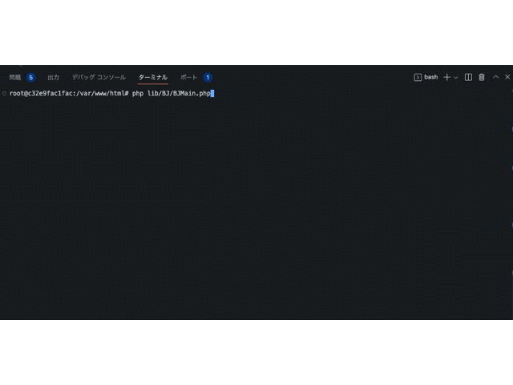
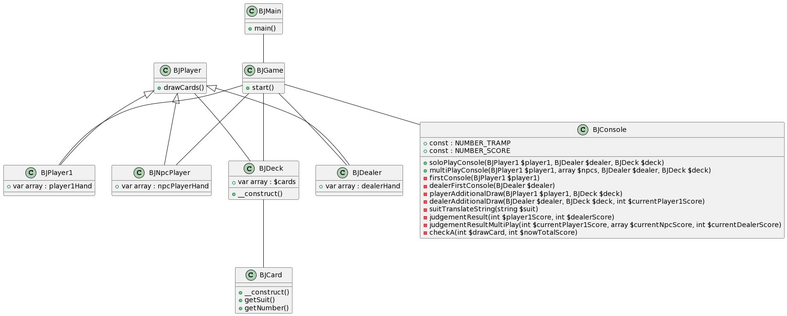
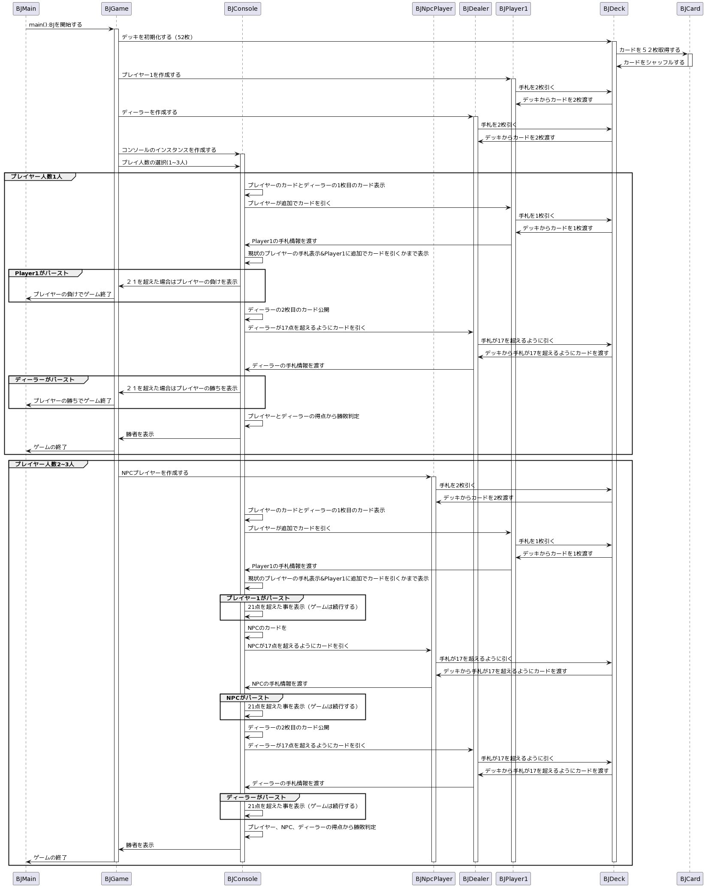

# *オブジェクト指向を用いたブラックジャックゲームの開発*
* コンソール上で動作するブラックジャックゲーム
* プレイヤー、NPC（1~2人）とディーラーで対戦

## 実行画面


# 開発目的
* 開発現場で必要とされるPHPの知識を習得する為
* オブジェクト指向の理解を深める為
* クラス設計・UMLの作成を学ぶ為

# 環境構築
## 環境構築(Locally Folder編)

```bash
# Docker イメージのビルド
docker-compose build

# Docker コンテナの起動
docker-compose up -d

# Docker コンテナ内でコマンドを実行する
docker-compose exec app php -v

# Docker コンテナの停止・削除
docker-compose down
```
コンソール上で以下コマンドを実行する事で動作します
```bash
docker compose exec app php lib/BJ/BJMain.php
```

## 環境構築 (Remote Development編)

Docker イメージをビルドする。

```bash
docker-compose build
```

VSCode の Remote-Containers: Open Folder in Container からコンテナを開く。

コマンドは VSCode のターミナルから実行する。

終了するときはコンテナを停止・削除する。

```bash
docker-compose down
```
コンソール上で以下コマンドを実行する事で動作します。
```bash
php lib/BJ/BJMain.php
```
# ブラックジャックゲームの仕様
## ルール
ブラックジャックはカジノで行われるカードゲームの一種です。1〜13までの数が書かれたカード52枚を使ってゲームが行われます。ルールは次の通りです。

* 実行開始時、ディーラーとプレイヤー全員に２枚ずつカードが配られる
* 自分のカードの合計値が21に近づくよう、カードを追加するか、追加しないかを決める
* カードの合計値が21を超えてしまった時点で、その場で負けが確定する
* プレイヤーはカードの合計値が21を超えない限り、好きなだけカードを追加できる
* ディーラーはカードの合計値が17を超えるまでカードを追加する

各カードの点数は次のように決まっています。

* 2から9までは、書かれている数の通りの点数
* 10,J,Q,Kは10点
* Aは1点あるいは11点として、手の点数が最大となる方で数える

自分、NPC、ディーラーの2~4人でプレイします。

## クラス図
クラスの関係、メソッド、プロパティを示したクラス図です。



## シーケンス図
ゲームの流れを示したシーケンス図です。


# 最後に
* 今回の開発は下記教材の課題になります。（この課題に回答は無く、自分自身で設計・実装・テストを行なっております）

独学エンジニア
<https://dokugaku-engineer.com/course/serverside>

* オブジェクト指向で実装を行う事により拡張性の高さを得られる事を実感

* PHPMDやPHPStanなどの静的解析ツールを用いて実装する事でコードの品質を考える機会になった

* Dockerを用いて環境構築を行う事でコンテナ技術の利便性を実感

* 自身で設計したものが形になり動作した時の喜びを体感

設計・実装を行う中で躓く事も多くありましたが、終始楽しく開発できました。

自分で実際に作る事が1番の学びになる事を実感したので、今後もまず手を動かしてみる事を大切にして学び続けます！！！
